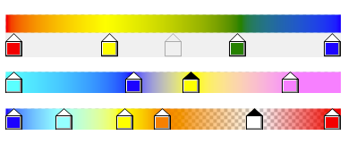

# GradientColorPicker Control for Windows Forms
[](https://www.visualstudio.com/)
[](https://docs.microsoft.com/en-us/dotnet/framework/winforms/)
[](https://www.microsoft.com/net/download)
[](https://github.com/meet-aleksey/GradientColorPicker/blob/master/LICENSE)
[](https://www.nuget.org/packages/GradientColorPicker/)

This is control for Windows Forms, which allows to select colors to create gradients.



## Install

To install GradientColorPicker control, run the following command in the Package Manager Console:

```
Install-Package GradientColorPicker
```

## How to use

Install the GradientColorPicker package in your Windows Forms project.

Or [download an archive file containing binary assemblies](https://github.com/meet-aleksey/GradientColorPicker/releases), 
unpack it and add to your project a reference to the assembly of the version of .NET Framework that you are using.

Now you can create an instance of the GradientColorPicker and add to the form:

```C#
// create a new instance of GradientColorPicker
var gradientColorPicker = new GradientColorPicker();

// for example, set the minimum number of items (colors)
gradientColorPicker.MinimumColorCount = 4;

// for example, randomize the postion and color of the items
gradientColorPicker1.Randomize(true, true);

// add the GradientColorPicker to the form
Controls.Add(gradientColorPicker);

// use the DrawLinearGradientToImage method to drawing linear gradient image
// for example, draw a gradient in the background image of the form

// create image 
BackgroundImage = new Bitmap(ClientSize.Width, ClientSize.Height);
// draw a linear gradient
gradientColorPicker1.DrawLinearGradientToImage(BackgroundImage);

// or DrawRadialGradientToImage method  to drawing radial gradient image

// we need to specify a central point
var centerPoint = new PointF(ClientSize.Width / 2, ClientSize.Height / 2);
// draw a radial gradient
gradientColorPicker1.DrawRadialGradientToImage(BackgroundImage, ClientRectangle, centerPoint);
```

If you can not find the control on the toolbox in designer mode, you need to add GradientColorPicker to the toolbox:

[](https://www.youtube.com/watch?v=Zasmw8zfIbI)

1. Right-click on toolbox
2. Select "Choose Items"
3. Browse the GradientColorPicker assembly on your computer.
4. Add the item.
5. Enjoy!

## Requirements

* .NET Framework 3.5/4.0/4.5/4.6/4.7 or later;
* Windows Forms.

## License

This project is licensed under the MIT License - see the [LICENSE](LICENSE) file for details.

Copyright © 2018, [@meet-aleksey](https://github.com/meet-aleksey)